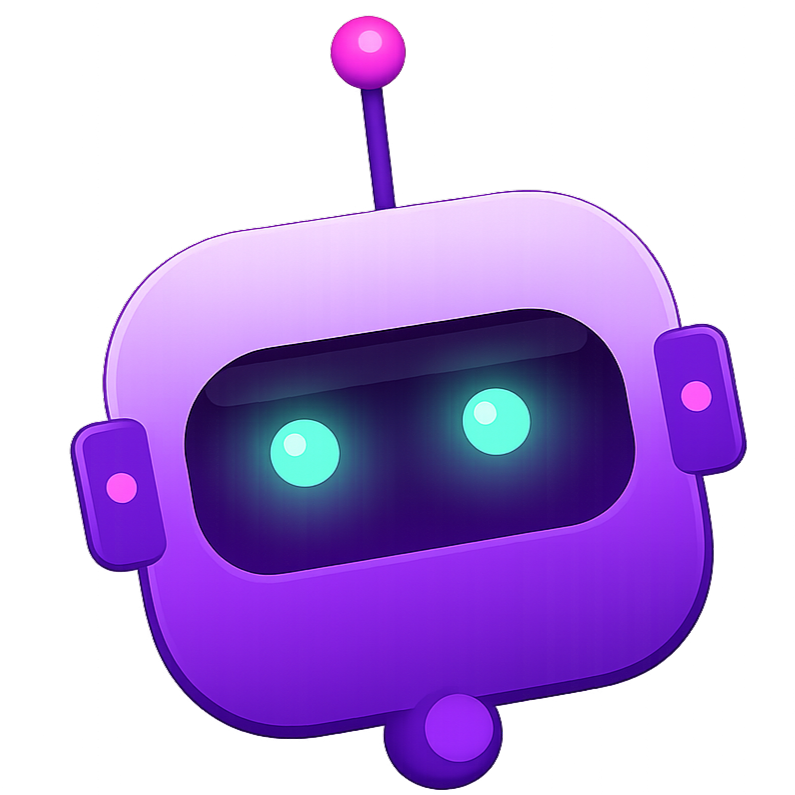

#  CloudBot Command Center

**View Live (Free PaaS Deployment):** [https://cloudbot-command-center.onrender.com](https://cloudbot-command-center.onrender.com)

An enterprise-grade, containerized Multi-Process Robotics Orchestration stack built on **ROS 2 Jazzy** and **FastAPI**. The system simulates a continuous warehouse delivery vehicle that executes autonomous waypoint navigation, runs localized obstacle detection physics, logs telemetry directly to **Google Firebase Firestore**, and streams real-time data to a cloud-ready web dashboard. 

The entire framework is isolated inside Docker containers and managed via an automated GitHub Actions CI/CD pipeline.

---

## 🏗️ System Architecture

The application is built using a decentralized microservice architecture:

* **Robotics Core (ROS 2):** Manages asynchronous nodes for sensory scanning, movement calculation, and path planning.
* **Web Gateway (FastAPI):** Serves the telemetry interface and exposes port mappings out of the virtual network loop.
* **Cloud Database (Firebase):** Captures high-frequency state changes and battery degradation logs.
* **Automation Framework (GitHub Actions):** Spawns cloud runners to build images and validate environment configurations on every code push.

---

## 🚀 Key Features

* **Autonomous State Management:** Simulates real-world hardware limits with live battery degradation and an API-triggered recharge loop.
* **Dynamic Obstacle Avoidance:** Sensor nodes constantly evaluate environment conditions and publish safety metrics to the navigation controller to prevent collisions.
* **Smart UI Feedback:** The responsive dashboard features event-driven toast notifications and dynamic rendering based on the robot's real-time coordinates.
* **Optimized Docker Footprint:** Leverages multi-stage builds and `.dockerignore` mechanisms to isolate host machine compilation debris from clean container layers.

---

## 🛠️ Tech Stack

* **Robotics:** ROS 2 (Jazzy), `colcon`, `rclpy`
* **Backend:** Python 3, FastAPI, Uvicorn, Firebase Admin SDK
* **Frontend:** HTML5, CSS3 (Flexbox), Vanilla JavaScript
* **DevOps:** Docker, Git, GitHub Actions, Render PaaS

---

## ⚡ Quick Start (Local Deployment)

To run the full stack locally on your machine using Docker Compose:

```bash
# Clone the repository
git clone [https://github.com/Rosh264/cloudbot.git](https://github.com/Rosh264/cloudbot.git)
cd cloudbot

# Build and launch the containerized environment
docker compose up --build -d

# Access the live dashboard
http://localhost:8000